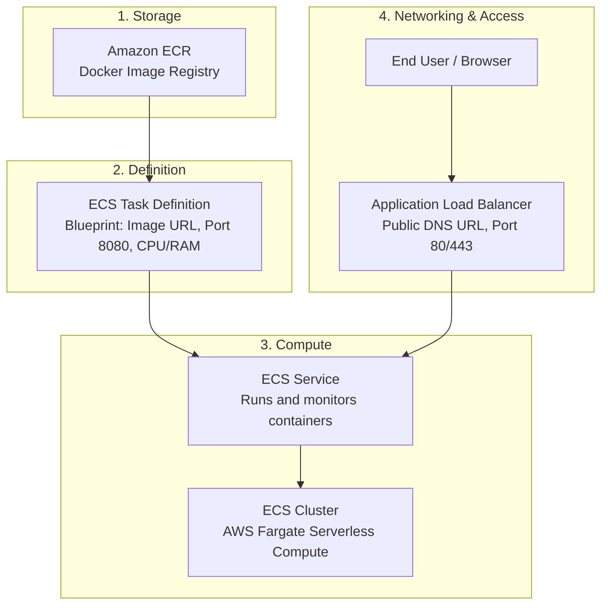

# Complete Guide: Deploying the Python Calculator App Using AWS Console (UI)

This step-by-step guide walks you through deploying the `calculator-app` to **Amazon Web Services (AWS)** entirely using the **AWS Management Console (Web UI)**.

---

## 🏗️ The DevOps Mental Model: How AWS Pieces Fit Together

Before clicking buttons, understand the 4 core components you will interact with:

1. **Amazon ECR (Elastic Container Registry):** Where your Docker container image is stored in the cloud (like private Docker Hub).
2. **ECS Task Definition:** The blueprint/recipe specifying container image URL, port `8080`, memory, and CPU.
3. **Amazon ECS Cluster & Service:** Manages running containers on **AWS Fargate** (serverless compute—no virtual machines to patch or maintain).
4. **Application Load Balancer (ALB):** Distributes web traffic from the internet to your container and gives you a public DNS link.

---

## Step 1: Sign In & Verify Region

1. Go to the [AWS Management Console](https://console.aws.amazon.com/).
2. Sign in as **IAM user**:
   - **Account ID:** `181511516422`
   - **User name:** `devops-admin`
   - **Password:** *[Your IAM user password]*
3. **Check Your Region:** Look at the top-right navigation bar (next to your username).
   - Ensure the region is set to **Asia Pacific (Mumbai) `ap-south-1`**.

---

## Step 2: Create a Container Repository in Amazon ECR

1. In the top search bar, search for **ECR** and click **Elastic Container Registry**.
2. Click **Repositories** on the left menu → click the orange **Create repository** button.
3. Configure the repository:
   - **Visibility settings:** Select **Private**.
   - **Repository name:** Enter `calculator-app`.
   - **Tag immutability:** Leave *Disabled* (Mutable).
4. Scroll to the bottom and click **Create repository**.
5. Click on your newly created repository (`calculator-app`) in the list:
   - Notice the **View push commands** button in the top right.
   - When clicked, AWS shows you the exact 4 terminal commands used to log in, build, tag, and push your Docker image to this repository.
   - *(Note: We already pushed image `calculator-app:latest` to your ECR registry via GitHub Actions!).*
   - Copy the **URI** of your image (it looks like: `181511516422.dkr.ecr.ap-south-1.amazonaws.com/calculator-app:latest`). You will need this in Step 4.

---

## Step 3: Create an ECS Cluster (Fargate)

1. In the top search bar, search for **ECS** and click **Elastic Container Service**.
2. On the left navigation pane, click **Clusters**.
3. Click the orange **Create cluster** button.
4. Configure the cluster:
   - **Cluster name:** Enter `devops-cluster` (or use existing `default`).
   - **Infrastructure:** Check **AWS Fargate (serverless)**.
5. Click **Create** at the bottom.
   - It will take about 10 seconds to show `Active`.

---

## Step 4: Create a Task Definition (The Container Blueprint)

1. In the left navigation pane under ECS, click **Task definitions**.
2. Click **Create new task definition** → select **Create new task definition** (with JSON or UI wizard).
3. Configure Task Definition parameters:
   - **Task definition family:** Enter `calculator-task`.
   - **Infrastructure requirements:**
     - Launch type: **AWS Fargate**.
     - Operating system / Architecture: **Linux/X86_64**.
     - CPU: **0.25 vCPU** (smallest and cheapest for testing).
     - Memory: **0.5 GB**.
   - **Task roles:**
     - **Task execution role:** Select `ecsTaskExecutionRole`. *(This allows ECS to pull images from ECR and write CloudWatch logs).*
4. Configure Container details:
   - **Container details:**
     - **Name:** `calculator-container`
     - **Image URI:** Paste your ECR image URI:  
       `181511516422.dkr.ecr.ap-south-1.amazonaws.com/calculator-app:latest`
     - **Essential container:** Yes.
   - **Port mappings:**
     - **Container port:** `8080`
     - **Protocol:** `TCP`
     - **Port name / App protocol:** `HTTP`
5. Scroll to the bottom and click **Create**.
   - You will see a success banner: *"Task definition created successfully"*.

---

## Step 5: Deploy the Service with an Application Load Balancer

Now you will tell ECS to run 1 copy of this container and attach a Load Balancer so you can access it via the web.

1. Go back to **Clusters** on the left menu → click your cluster (`devops-cluster` or `default`).
2. Under the **Services** tab, click **Deploy** (or **Create**).
3. Configure the Service:
   - **Environment:**
     - Compute options: **Launch type**.
     - Launch type: **FARGATE**.
     - Platform version: `LATEST`.
   - **Deployment configuration:**
     - Application type: **Service**.
     - Family: Select `calculator-task` (Revision: latest).
     - Service name: Enter `calculator-web-service`.
     - Service type: **Replica**.
     - Desired tasks: `1`.
4. **Networking (VPC & Subnets):**
   - **VPC:** Select your Default VPC.
   - **Subnets:** Select all default public subnets (e.g., `ap-south-1a`, `ap-south-1b`, `ap-south-1c`).
   - **Security group:** Select **Create a new security group**:
     - Security group name: `calculator-sg`.
     - Inbound rule: Type **HTTP**, Port **8080**, Source **Anywhere-IPv4 (0.0.0.0/0)**.
   - **Public IP:** Turn **ON** (Enabled).
5. **Load Balancing (Very Important):**
   - **Load balancer type:** Select **Application Load Balancer**.
   - **Load balancer name:** Enter `calculator-alb`.
   - **Container:** `calculator-container 8080:8080`.
   - **Listener:**
     - Port: `80`
     - Protocol: `HTTP`
   - **Target group:**
     - Target group name: `calculator-tg`.
     - Health check path: Enter `/health` *(Our Flask app responds with `{"status":"ok"}` here)*.
6. Scroll down and click **Deploy** (or **Create**).

---

## Step 6: Verify Your Live App in the Browser

1. Wait 2 to 3 minutes for the Fargate task to launch and pass health checks.
2. Under your cluster's **Services** tab, click on `calculator-web-service`:
   - Under **Deployment status**, verify it shows `PRIMARY` and **Running tasks: 1**.
3. Now find your public website URL:
   - In the top search bar, search for **EC2** and click it.
   - On the left sidebar, scroll down and click **Load Balancers** (under *Load Balancing*).
   - Click on your load balancer (`calculator-alb`).
   - In the **Basic details** panel, copy the **DNS name** (e.g., `calculator-alb-123456789.ap-south-1.elb.amazonaws.com`).
4. Paste that DNS name into your browser URL bar!
   - You will see the interactive **DevOps Calculator** page.
   - Perform math operations (e.g. `12 + 34`) to verify the Flask backend handles the requests.

---

## Step 7: Clean-Up Guide (DevOps Cost Protection)

> [!CAUTION]
> Always clean up test infrastructure in AWS when you are done studying or testing. Load balancers and active containers accrue hourly charges if left running!

Follow these steps in the console to bring your bill back to **$0**:

### 1. Delete the ECS Service
1. Go to **Amazon ECS** → **Clusters** → click your cluster.
2. In the **Services** tab, select the checkbox next to `calculator-web-service` (and any old `calculator-service`).
3. Click **Delete** at the top.
4. Type `delete` in the confirmation box and confirm. *(This immediately terminates the running Fargate containers).*

### 2. Delete the Application Load Balancer
1. Go to **EC2** → **Load Balancers** on the left menu.
2. Select your load balancer (`calculator-alb` or `ecs-express-gateway-alb-...`).
3. Click **Actions** (top right) → **Delete load balancer**.
4. Confirm deletion. *(This stops the ~$0.54/day ALB and public IP fees).*

### 3. Delete the Target Group
1. Under **Load Balancing** on the left menu, click **Target Groups**.
2. Select the target groups created for the calculator.
3. Click **Actions** → **Delete**.

### 4. Delete the ECS Cluster (Optional)
1. Go to **Amazon ECS** → **Clusters**.
2. Select your cluster → click **Delete cluster** → confirm.

---

## Summary: Console (UI) vs. CI/CD (Automation)

| Task | Console (UI) Way | DevOps / CI/CD Way (What we built) |
| :--- | :--- | :--- |
| **Effort** | 15–20 manual clicks across 4 services | Single `git push` |
| **Repeatability** | Prone to human error / typos | 100% reproducible through code |
| **Testing** | Manually test after deployment | Automated `pytest` run before deploying |
| **Best Used For** | Initial learning, inspecting state, debugging | Real production deployments, team collaboration |
